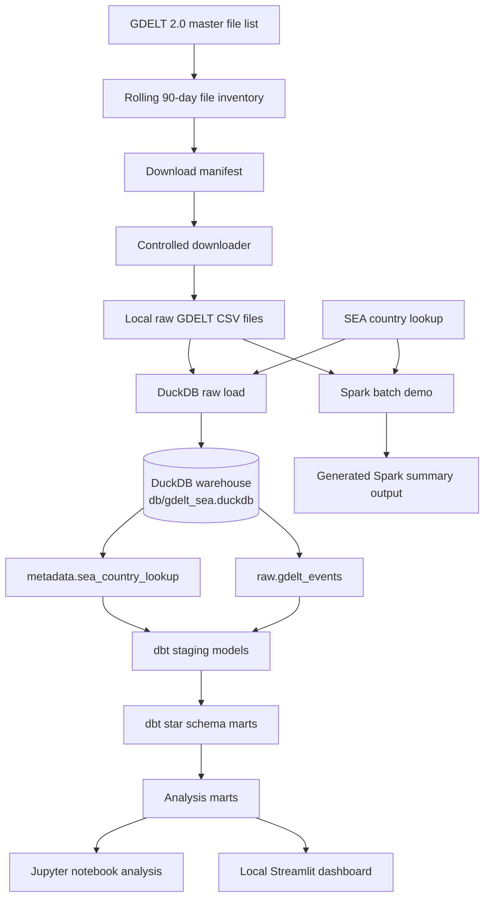
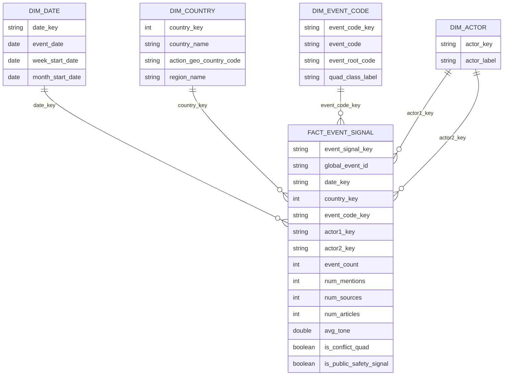

# RCI GDELT SEA Signal Pipeline

## Current MVP Status

This project is a local data engineering prototype that uses GDELT 2.0 Events data to monitor public-safety-related event signals across Southeast Asia.

The current implementation is complete through **Block 16**.

The core MVP includes:

- GDELT source discovery and rolling file inventory
- controlled raw file download and extraction
- Southeast Asia country-code filtering
- local DuckDB analytical warehouse
- dbt staging models, star schema and analysis marts
- dbt data quality tests
- Jupyter notebook analysis
- local Streamlit dashboard
- optional Spark batch-processing demonstration
- local orchestration runner
- local scheduled refresh scaffold
- architecture, lineage, schema and defence documentation

This is an individual learning MVP. It prioritises reproducibility, explainability and defensibility over production hardening.

---

## Project Purpose

This project builds a local data engineering pipeline using **GDELT 2.0 Events** data to monitor media-coded event signals across Southeast Asia.

The project is designed as both:

1. a practical Module 2 data engineering project, and  
2. a prototype pattern for future Red Cloud Intelligence-style open-source intelligence workflows.

The core question is:

> How can public-safety stakeholders monitor evolving conflict and disorder signals across Southeast Asia using regularly refreshed open news-event data?

Important framing:

> GDELT is treated as a **media-coded event signal source**, not as a verified ground-truth incident database.

The outputs should therefore be interpreted as directional signals for monitoring and further investigation, not confirmed incident counts.

---

## Primary Use Cases

### Use Case 1: Regional Spike Monitoring

Monitor weekly country-level event signal volumes across Southeast Asia and flag simple week-on-week spikes.

Example questions:

- Which countries show sudden increases in event signal volume?
- Which countries show higher conflict-related signal counts?
- Which signals may warrant closer analyst review?

### Use Case 2A: Country Event Profile

Profile dominant event codes and event classes by country.

Example questions:

- What types of events dominate each country’s signal profile?
- Which event codes are most frequently observed?
- Are signals mostly verbal cooperation, verbal conflict, material cooperation or material conflict?

### Use Case 2B: Country Actor Profile

Profile frequently appearing actor labels by country and actor position.

Example questions:

- Which actor labels appear most frequently in a country’s event signals?
- Are actors appearing as Actor 1 or Actor 2?
- Which actor labels are associated with conflict or public-safety-related signals?

---

## Scope

Current geographic scope:

- Brunei
- Cambodia
- Indonesia
- Laos
- Malaysia
- Myanmar
- Philippines
- Singapore
- Thailand
- Timor-Leste
- Vietnam

The project uses `ActionGeo_CountryCode` to scope events by **event location**, not actor nationality.

This means the project asks:

> Where did the event happen?

not:

> Where are the actors from?

---

## High-Level Architecture



---

## Core Data Flow

```text
GDELT master file list
    ↓
Rolling 90-day inventory
    ↓
Download manifest
    ↓
Controlled downloader
    ↓
Local raw GDELT CSV files
    ↓
DuckDB raw load with SEA filtering
    ↓
raw.gdelt_events
    ↓
dbt staging models
    ↓
dbt star schema marts
    ↓
analysis marts
    ↓
Jupyter notebook / Streamlit dashboard
```

---

## Technology Stack

| Layer | Tool | Purpose |
|---|---|---|
| Source discovery | Python | Read GDELT master file list and identify expected event files |
| Raw download | Python | Build manifest, download and extract controlled raw files |
| Local warehouse | DuckDB | Store SEA-filtered raw rows and downstream warehouse tables |
| Transformation | dbt + dbt-duckdb | Build staging models, star schema and marts |
| Testing | dbt tests | Validate not-null, uniqueness and relationship rules |
| Analysis | Jupyter | Analyse marts and export small evidence outputs |
| Dashboard | Streamlit | Local dashboard for stakeholder-style exploration |
| Batch demo | Spark | Optional local distributed batch-processing demonstration |
| Orchestration | Python / Bash | One-command pipeline runner and local refresh wrapper |

---

## Design Choice: DuckDB as Local Data Warehouse

For this individual prototype, DuckDB acts as both the database engine and the local analytical warehouse.

The warehouse file is:

```text
db/gdelt_sea.duckdb
```

DuckDB was selected because it is:

- local and lightweight
- suitable for analytical SQL
- simple to use for an individual project
- easy to connect to Python
- compatible with dbt through `dbt-duckdb`
- reproducible without requiring cloud infrastructure

For a multi-user group project, a shared warehouse such as Google BigQuery may be more suitable for collaboration.

---

## Repository Structure

```text
rci-gdelt-sea-signal-pipeline/
├── dashboard/
│   └── app.py
├── data/
│   ├── lookup/
│   │   └── sea_country_codes.csv
│   ├── processed/
│   └── raw/
├── db/
│   └── gdelt_sea.duckdb
├── dbt/
│   └── gdelt_sea/
├── docs/
│   ├── architecture.md
│   ├── data_lineage.md
│   ├── schema_overview.md
│   ├── defence_notes.md
│   └── local_scheduled_refresh.md
├── logs/
├── notebooks/
│   └── block_11_analysis.ipynb
├── outputs/
│   ├── figures/
│   └── tables/
├── scripts/
├── .env.example
├── .gitignore
├── README.md
├── requirements.txt
└── requirements-spark.txt
```

---

## Quickstart: Run Locally

### 1. Activate the core environment

```bash
conda activate elt
cd ~/code/ntu-sctp/repos/rci-gdelt-sea-signal-pipeline
```

### 2. Run the full local pipeline

```bash
python scripts/run_pipeline.py --days 90 --max-files 14
```

### 3. Safer rerun using existing local files

```bash
python scripts/run_pipeline.py --days 90 --max-files 14 --skip-download
```

### 4. Run dbt directly

```bash
cd dbt/gdelt_sea
dbt debug --profiles-dir .
dbt run --profiles-dir .
dbt test --profiles-dir .
```

Expected test result:

```text
PASS=60
WARN=0
ERROR=0
TOTAL=60
```

### 5. Run the local Streamlit dashboard

From project root:

```bash
streamlit run dashboard/app.py
```

If the `streamlit` command is not found:

```bash
python -m streamlit run dashboard/app.py
```

Open the local URL shown in the terminal, usually:

```text
http://localhost:8501
```

---

## Current Scripts

### Source Discovery and Inventory

```text
scripts/p02_01_gdelt_source_smoke_test.py
scripts/p02_02_gdelt_90day_inventory.py
```

### Download Manifest and Controlled Downloader

```text
scripts/p03_01_gdelt_download_manifest.py
scripts/p03_02_gdelt_controlled_downloader.py
```

### DuckDB File Query and Raw Loading

```text
scripts/p04_01_gdelt_sea_filter_test.py
scripts/p05_01_load_raw_gdelt_to_duckdb.py
```

### Notebook Creation

```text
scripts/p11_01_create_analysis_notebook.py
```

### Spark Demonstration

```text
scripts/p13_01_spark_batch_demo.py
```

### Orchestration Runner

```text
scripts/run_pipeline.py
```

### Scheduled Refresh

```text
scripts/run_scheduled_refresh.sh
docs/local_scheduled_refresh.md
```

### Dashboard

```text
dashboard/app.py
```

### Documentation

```text
docs/architecture.md
docs/data_lineage.md
docs/schema_overview.md
docs/defence_notes.md
```

---

## DuckDB Warehouse Objects

The local warehouse is implemented in:

```text
db/gdelt_sea.duckdb
```

Current schemas and key objects:

```text
metadata.sea_country_lookup

raw.gdelt_events

staging.stg_gdelt_events
staging.stg_sea_countries

marts.dim_date
marts.dim_country
marts.dim_event_code
marts.dim_actor
marts.fact_event_signal

marts.mart_regional_spike_monitoring
marts.mart_country_event_profile
marts.mart_country_actor_profile
```

---

## Warehouse Layers

### `metadata`

Reference and supporting tables.

Main table:

```text
metadata.sea_country_lookup
```

This defines the Southeast Asia country scope and GDELT/FIPS country codes.

### `raw`

SEA-filtered raw GDELT event rows.

Main table:

```text
raw.gdelt_events
```

Important note:

`raw.gdelt_events` is raw relative to transformation, but not global-unfiltered raw. It is already scoped to Southeast Asia using `ActionGeo_CountryCode`.

### `staging`

Cleaned, renamed and typed dbt staging models.

Main models:

```text
staging.stg_gdelt_events
staging.stg_sea_countries
```

### `marts`

Star schema and analysis-ready marts.

Main star schema models:

```text
marts.dim_date
marts.dim_country
marts.dim_event_code
marts.dim_actor
marts.fact_event_signal
```

Main analysis marts:

```text
marts.mart_regional_spike_monitoring
marts.mart_country_event_profile
marts.mart_country_actor_profile
```

---

## Star Schema Overview



---

## Current Implementation Status

### Block 0: Project setup and repo skeleton

Status: Completed.

Completed work:

- Created project repository and folder structure.
- Added base project files:
  - `README.md`
  - `requirements.txt`
  - `.env.example`
  - `.gitignore`
- Established folders for:
  - scripts
  - data
  - database
  - dbt
  - notebooks
  - dashboard
  - outputs
  - logs
  - documentation

### Block 1: Environment and package setup

Status: Completed.

Completed work:

- Used the `elt` conda environment for the core pipeline.
- Confirmed Python, DuckDB, dbt and Streamlit support.
- Registered `Python (elt)` as a usable notebook kernel.
- Kept Spark dependency separate under `requirements-spark.txt`.

### Block 2: GDELT source discovery and 90-day inventory

Status: Completed.

Completed work:

- Created GDELT source smoke test.
- Confirmed GDELT master file list access.
- Confirmed raw GDELT event file readability.
- Created rolling 90-day event file inventory logic.
- Confirmed 90-day expected file universe based on 15-minute GDELT intervals.

Scripts:

```text
scripts/p02_01_gdelt_source_smoke_test.py
scripts/p02_02_gdelt_90day_inventory.py
```

### Block 3: Download manifest and controlled downloader

Status: Completed.

Completed work:

- Created download manifest logic.
- Compared expected GDELT files against local file state.
- Created controlled downloader.
- Added maximum file safety control.
- Downloaded and extracted a controlled local sample.

Scripts:

```text
scripts/p03_01_gdelt_download_manifest.py
scripts/p03_02_gdelt_controlled_downloader.py
```

### Block 4: DuckDB file-query and SEA filtering prototype

Status: Completed.

Completed work:

- Created DuckDB file-query prototype.
- Read extracted GDELT event CSV files directly.
- Applied Southeast Asia filtering using `ActionGeo_CountryCode`.
- Used `data/lookup/sea_country_codes.csv` as explicit country scope.
- Confirmed SEA-filtered rows could be previewed before warehouse loading.

Script:

```text
scripts/p04_01_gdelt_sea_filter_test.py
```

### Block 5: Load raw table into DuckDB

Status: Completed.

Completed work:

- Created local DuckDB warehouse:
  - `db/gdelt_sea.duckdb`
- Created metadata table:
  - `metadata.sea_country_lookup`
- Created raw event table:
  - `raw.gdelt_events`
- Loaded SEA-filtered GDELT event rows into DuckDB.
- Added basic source traceability fields such as filename and load timestamp.

Script:

```text
scripts/p05_01_load_raw_gdelt_to_duckdb.py
```

### Block 6: dbt-duckdb project setup

Status: Completed.

Completed work:

- Created dbt project under:
  - `dbt/gdelt_sea/`
- Configured dbt-duckdb connection to:
  - `db/gdelt_sea.duckdb`
- Added local `profiles.yml.example`.
- Created source definitions for:
  - `raw.gdelt_events`
- Created initial staging model:
  - `staging.stg_gdelt_events`
- Confirmed:
  - `dbt debug`
  - `dbt run`
  - `dbt test`

### Block 7: Staging models

Status: Completed.

Completed work:

- Expanded `staging.stg_gdelt_events` into a fuller cleaned and typed staging model.
- Standardised raw GDELT field names into readable snake_case.
- Parsed event dates and derived:
  - `event_week_start`
  - `event_month_start`
- Added event classification fields:
  - `quad_class_label`
  - `is_conflict_quad`
  - `is_public_safety_signal`
- Created `staging.stg_sea_countries` from the Southeast Asia country lookup.
- Added dbt source definitions and staging tests.

Current staging models:

```text
staging.stg_gdelt_events
staging.stg_sea_countries
```

### Block 8: Star schema dimensions and fact table

Status: Completed.

Completed work:

- Created star schema mart models:
  - `marts.dim_date`
  - `marts.dim_country`
  - `marts.dim_event_code`
  - `marts.dim_actor`
  - `marts.fact_event_signal`
- Created surrogate-style keys for fact and dimension joins.
- Converted staged event records into fact rows for analysis.
- Added dimension and fact tests.

Current star schema:

```text
marts.dim_date
marts.dim_country
marts.dim_event_code
marts.dim_actor
marts.fact_event_signal
```

### Block 9: Analysis marts

Status: Completed.

Completed work:

- Created analysis marts aligned to the project use cases:
  - `marts.mart_regional_spike_monitoring`
  - `marts.mart_country_event_profile`
  - `marts.mart_country_actor_profile`
- Added simple week-on-week spike monitoring logic.
- Added country-level event profile outputs.
- Added country-level actor profile outputs.
- Confirmed marts build successfully through dbt.

### Block 10: Data quality tests

Status: Completed.

Completed work:

- Expanded dbt tests across staging, dimensions, fact and marts.
- Added not-null tests for important fields.
- Added uniqueness tests for key fields.
- Added relationship tests between fact and dimension models.
- Confirmed dbt test result:

```text
PASS=60
WARN=0
ERROR=0
TOTAL=60
```

### Block 11: Notebook analysis

Status: Completed.

Completed work:

- Created analysis notebook:
  - `notebooks/block_11_analysis.ipynb`
- Used `Python (elt)` kernel.
- Read analysis marts from DuckDB.
- Produced summary views for:
  - pipeline row counts
  - regional spike monitoring
  - country event profile
  - country actor profile
- Exported small generated outputs into:
  - `outputs/tables/`

### Block 12: Local Streamlit dashboard

Status: Completed.

Completed work:

- Created local dashboard:
  - `dashboard/app.py`
- Dashboard reads from DuckDB marts.
- Added country filter.
- Added sections for:
  - pipeline summary
  - regional spike monitoring
  - country event profile
  - country actor profile
- Confirmed dashboard runs locally through:

```bash
streamlit run dashboard/app.py
```

### Block 13: Spark distributed batch demonstration

Status: Completed as a controlled local Spark demo.

Completed work:

- Created Spark demo script:
  - `scripts/p13_01_spark_batch_demo.py`
- Used PySpark in local mode through the `bde` conda environment.
- Read a small controlled subset of extracted raw GDELT CSV files.
- Applied the Southeast Asia country lookup filter using Spark DataFrames.
- Aggregated event signal counts by country.
- Saved a small generated output to:
  - `outputs/tables/spark_sea_country_summary.csv`
- Kept Spark as a demonstration layer, not the core production path.

Environment note:

- Core pipeline uses the `elt` environment.
- Spark demo uses the `bde` environment.
- Optional Spark dependency is listed in:
  - `requirements-spark.txt`

### Block 14: One-command orchestration runner

Status: Completed as a local orchestration runner.

Completed work:

- Created one-command pipeline runner:
  - `scripts/run_pipeline.py`
- Added command-line options for:
  - rolling inventory window using `--days`
  - controlled download volume using `--max-files`
  - latest/oldest download ordering using `--order`
  - skipping download using `--skip-download`
  - skipping dbt using `--skip-dbt`
  - including optional smoke tests using `--include-smoke-tests`
- Confirmed the runner can execute the core local pipeline sequence:
  - build rolling GDELT inventory
  - build download manifest
  - controlled download/extraction
  - load SEA-filtered rows into DuckDB
  - run `dbt debug`
  - run `dbt run`
  - run `dbt test`
- Confirmed successful end-to-end run with:

```text
PASS=60
WARN=0
ERROR=0
TOTAL=60
```

Example usage:

```bash
python scripts/run_pipeline.py --days 90 --max-files 14
```

Safer rerun using existing local files:

```bash
python scripts/run_pipeline.py --days 90 --max-files 14 --skip-download
```

### Block 15: Local scheduled refresh

Status: Completed as a local scheduled refresh scaffold.

Completed work:

- Created local scheduled refresh wrapper:
  - `scripts/run_scheduled_refresh.sh`
- Added timestamped pipeline logging to:
  - `logs/`
- The wrapper:
  - activates the `elt` conda environment
  - runs `scripts/run_pipeline.py`
  - supports configurable `DAYS`, `MAX_FILES`, and `ORDER`
  - passes extra command-line arguments through to the pipeline runner
- Added local scheduling documentation:
  - `docs/local_scheduled_refresh.md`
- Included examples for:
  - safe manual rerun with `--skip-download`
  - tiny controlled refresh using `MAX_FILES=1`
  - WSL cron concept
  - Windows Task Scheduler concept

Note:

- This is a local scheduled refresh scaffold, not production orchestration.
- Logs are generated locally and ignored by Git.

### Block 16: Documentation and architecture diagrams

Status: Completed.

Completed work:

- Added architecture documentation:
  - `docs/architecture.md`
- Added data lineage documentation:
  - `docs/data_lineage.md`
- Added warehouse schema overview:
  - `docs/schema_overview.md`
- Added defence notes:
  - `docs/defence_notes.md`
- Included Mermaid diagrams for:
  - high-level architecture
  - data lineage
  - warehouse schema layers
  - star schema relationship overview

Note:

- These documents are intended to make the project easier to explain, defend and hand over.
- The diagrams are text-based Mermaid diagrams, so they can render directly in GitHub Markdown.

---

## Generated Files and Git Policy

The following files and folders are generated locally and should not normally be committed:

```text
data/raw/
data/processed/
db/*.duckdb
logs/
outputs/
```

These are ignored through `.gitignore`.

The repository should track:

```text
source code
dbt models
documentation
configuration templates
README instructions
```

The repository should not track:

```text
large downloaded data files
generated database files
generated logs
generated dashboard/notebook outputs
temporary local files
```

For final demonstration evidence, use a small curated folder if needed, such as:

```text
docs/sample_outputs/
```

rather than committing large generated data or database files.

---

## Key Limitations

- Current outputs are based on a controlled local sample, not necessarily the full 90-day universe.
- GDELT is a media-coded event signal source, not verified ground truth.
- Actor labels and event codes can be noisy and should be interpreted directionally.
- The spike flag is a simple demonstration rule, not a production alerting model.
- The Streamlit dashboard is a local demo layer, not a deployed production application.
- The Spark component is a local demonstration, not the core processing path.
- The scheduled refresh wrapper is a local scaffold, not production orchestration.
- The project currently prioritises learning, reproducibility and explainability over production hardening.

---

## Optional Extension Roadmap

The following blocks are optional future extensions beyond the current completed implementation.

Blocks 0–16 are already completed and documented under Current Implementation Status.

### Block 17: Final packaging and presentation readiness

Status: Planned.

Planned work:

- Prepare final presentation storyline.
- Prepare short project defence script.
- Prepare block-by-block explanation.
- Prepare screenshots or sample outputs if required.
- Confirm README and docs are clean.
- Confirm GitHub repo is easy to navigate.

### Block 18: BigQuery public dataset smoke test

Status: Optional / planned.

Possible work:

- Run a small BigQuery public dataset query.
- Demonstrate BigQuery familiarity separately from the core DuckDB pipeline.
- Avoid changing the core individual project architecture unless required.

### Block 19: BigQuery comparison notes

Status: Optional / planned.

Possible work:

- Compare DuckDB and BigQuery for:
  - local individual prototype
  - group collaboration
  - cloud warehouse convenience
  - reproducibility
  - cost/control considerations
  - ingestion learning value
  - scale and performance implications

---

## Module 2 Learning Elements Demonstrated

This project demonstrates:

- public dataset source discovery
- file-based batch ingestion
- controlled downloader design
- raw landing zone pattern
- local analytical warehouse implementation
- DuckDB SQL workflow
- dbt source definitions
- dbt staging models
- dbt star schema modelling
- dbt analysis marts
- dbt data quality tests
- Jupyter notebook analysis
- local Streamlit dashboard
- optional Spark batch-processing demo
- local one-command orchestration runner
- local scheduled refresh scaffold
- architecture and lineage documentation
- generated file and Git hygiene

---

## Defence Notes

The strongest way to explain the project:

1. Python discovers and downloads GDELT files.
2. DuckDB acts as the local analytical warehouse.
3. dbt transforms raw warehouse data into staging models, a star schema and analysis marts.
4. dbt tests validate the important keys, fields and relationships.
5. Notebook and Streamlit layers read from the marts.
6. Spark is included only as an optional distributed batch-processing demonstration.
7. Local orchestration and refresh scripts make the workflow easier to rerun.
8. Documentation explains the architecture, lineage, schema and project defence framing.

Short defence script:

> This project follows an ELT pattern. Python discovers and downloads GDELT event files, then loads Southeast Asia-filtered event rows into DuckDB. dbt transforms the raw data into staging models, a star schema and analysis marts, with tests for key fields and relationships. The notebook and dashboard read from the marts to support regional spike monitoring and country-level event and actor profiling. Spark and local scheduling are included as optional demonstrations, while the core MVP remains DuckDB and dbt for simplicity and reproducibility.

---

## Next Step

Current implementation is complete through Block 16.

Recommended next work:

- Review the full implementation journey from Block 0 onward in defence-ready language.
- Prepare final packaging and presentation readiness under Block 17.
- Keep Blocks 18 and 19 as optional BigQuery comparison or smoke-test extensions.