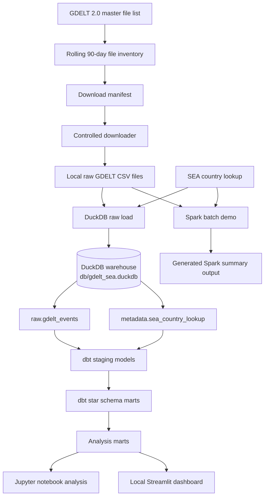

# Architecture Overview

This project implements a local data engineering pipeline using GDELT 2.0 Events data to monitor public-safety-related event signals across Southeast Asia.

The core MVP uses:

- Python for source discovery, download control, raw loading and orchestration
- DuckDB as the local analytical warehouse
- dbt + dbt-duckdb for transformation, modelling and tests
- Jupyter for notebook analysis
- Streamlit for a local dashboard
- Spark as an optional distributed batch-processing demonstration

## High-Level Architecture



## Core Pipeline Layers

| Layer | Tool | Purpose |
|---|---|---|
| Source discovery | Python | Read GDELT master file list and identify expected event files |
| Raw landing | Python / local filesystem | Store downloaded and extracted GDELT event CSV files |
| Local warehouse | DuckDB | Store SEA-filtered raw event rows and downstream warehouse tables |
| Transformation | dbt + dbt-duckdb | Build staging models, star schema and analysis marts |
| Quality checks | dbt tests | Validate keys, not-null rules, uniqueness and relationships |
| Analysis | Jupyter | Explore and explain output marts |
| Presentation | Streamlit | Provide a simple local dashboard |
| Optional batch demo | Spark | Demonstrate distributed batch-processing concepts |

## Design Choice: DuckDB as Local Warehouse

DuckDB is used as the local analytical warehouse for the individual prototype.

The warehouse is implemented as:

```text
db/gdelt_sea.duckdb
```

DuckDB was selected because it is:

- local and lightweight
- suitable for analytical SQL
- easy to connect to Python
- compatible with dbt through `dbt-duckdb`
- appropriate for a reproducible individual MVP

For a multi-user group project, a shared cloud warehouse such as BigQuery may be more suitable for collaboration.