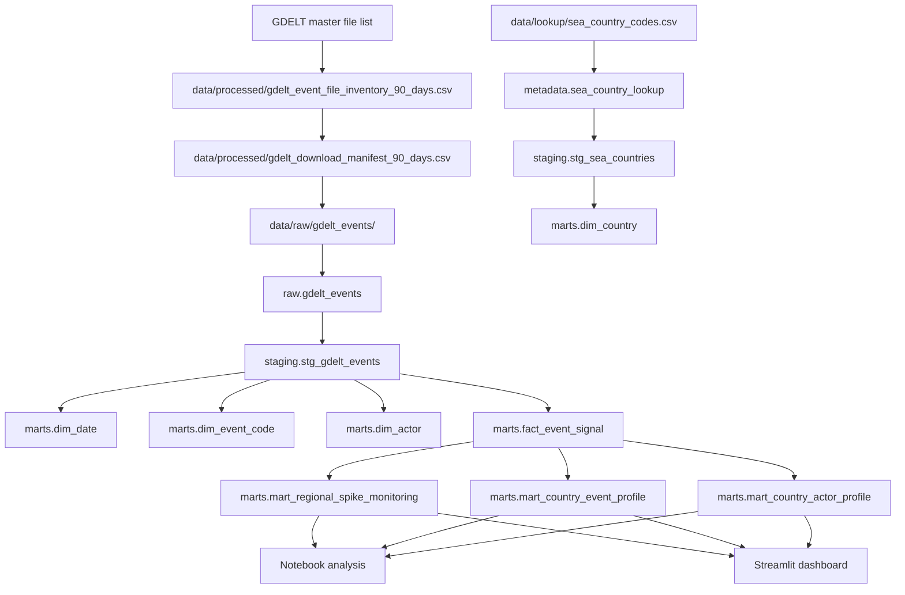

# Data Lineage

This document explains how data flows through the RCI GDELT SEA signal pipeline.

## Lineage Summary



## Block-by-Block Data Flow

### Block 2: Source discovery and inventory

The pipeline reads the GDELT master file list and creates a rolling 90-day event file inventory.

Generated output:

```text
data/processed/gdelt_event_file_inventory_90_days.csv
```

### Block 3: Download manifest and controlled downloader

The pipeline compares expected files against local files and creates a download manifest.

Generated output:

```text
data/processed/gdelt_download_manifest_90_days.csv
```

The controlled downloader then downloads and extracts a safe sample of GDELT files into the raw landing zone.

Generated local files:

```text
data/raw/gdelt_events/
```

### Block 4: SEA filtering prototype

DuckDB is used to test whether raw GDELT files can be filtered to Southeast Asia using:

```text
ActionGeo_CountryCode
```

and:

```text
data/lookup/sea_country_codes.csv
```

### Block 5: Raw load into DuckDB

The pipeline creates the local DuckDB warehouse:

```text
db/gdelt_sea.duckdb
```

It creates:

```text
metadata.sea_country_lookup
raw.gdelt_events
```

The raw event table is raw relative to transformation, but already scoped to Southeast Asia.

### Block 6 to 10: dbt transformation and testing

dbt transforms the raw tables into:

```text
staging.stg_gdelt_events
staging.stg_sea_countries
marts.dim_date
marts.dim_country
marts.dim_event_code
marts.dim_actor
marts.fact_event_signal
marts.mart_regional_spike_monitoring
marts.mart_country_event_profile
marts.mart_country_actor_profile
```

dbt tests validate basic quality rules including not-null, uniqueness and relationships.

### Block 11: Notebook analysis

The notebook reads from dbt marts and exports small analysis outputs.

### Block 12: Streamlit dashboard

The local Streamlit dashboard reads from the marts inside DuckDB.

### Block 13: Spark batch demo

The Spark demo reads a small subset of raw GDELT files, applies the SEA lookup filter and writes a generated summary output.

### Block 14 and 15: Orchestration and refresh

The pipeline can be rerun through:

```text
scripts/run_pipeline.py
```

and wrapped for local scheduled refresh through:

```text
scripts/run_scheduled_refresh.sh
```

## Generated Files Policy

Generated files are intentionally ignored by Git, including:

```text
data/raw/
data/processed/
db/*.duckdb
logs/
outputs/
```

The repository stores the code and instructions needed to reproduce outputs, not the generated data itself.