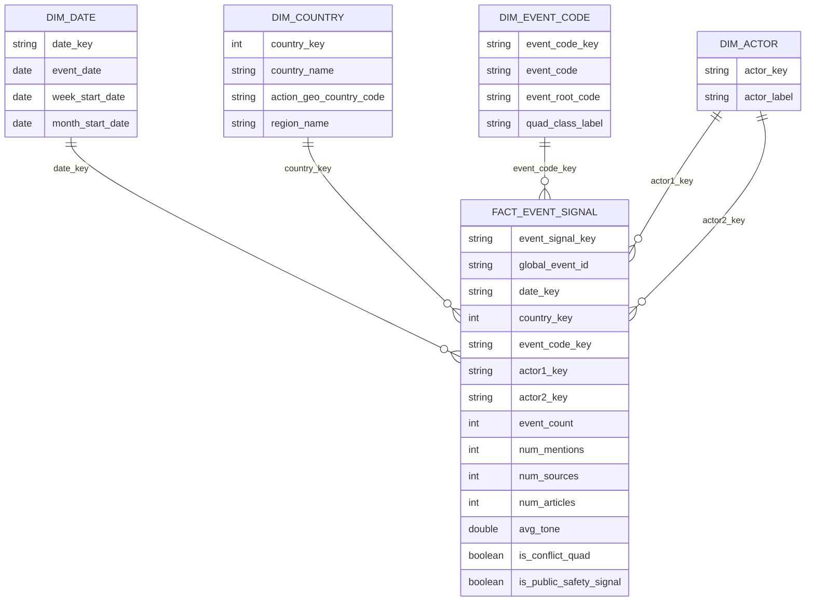

# Schema Overview

This project uses DuckDB as a local analytical warehouse.

The warehouse file is:

```text
db/gdelt_sea.duckdb
```

## Warehouse Layers

```mermaid
flowchart TD
    A[metadata schema] --> A1[metadata.sea_country_lookup]
    B[raw schema] --> B1[raw.gdelt_events]
    C[staging schema] --> C1[staging.stg_gdelt_events]
    C --> C2[staging.stg_sea_countries]
    D[marts schema] --> D1[marts.dim_date]
    D --> D2[marts.dim_country]
    D --> D3[marts.dim_event_code]
    D --> D4[marts.dim_actor]
    D --> D5[marts.fact_event_signal]
    D --> D6[marts.mart_regional_spike_monitoring]
    D --> D7[marts.mart_country_event_profile]
    D --> D8[marts.mart_country_actor_profile]
```



## Schema Purposes

| Schema | Purpose |
|---|---|
| `metadata` | Reference and supporting tables |
| `raw` | SEA-filtered raw GDELT event rows loaded from local CSV files |
| `staging` | Cleaned, renamed and typed dbt staging models |
| `marts` | Star schema and analysis-ready marts |

## Key Tables

### `metadata.sea_country_lookup`

Reference table containing Southeast Asia country names and GDELT/FIPS country codes.

Purpose:

- defines project geography
- supports SEA filtering
- feeds `staging.stg_sea_countries`

### `raw.gdelt_events`

SEA-filtered GDELT event rows loaded into DuckDB.

Important note:

This table is raw relative to transformation, but not global-unfiltered raw. It has already been scoped to Southeast Asia using `ActionGeo_CountryCode`.

### `staging.stg_gdelt_events`

Cleaned staging view over `raw.gdelt_events`.

Typical staging work includes:

- renaming fields into readable snake_case
- parsing event dates
- deriving week and month fields
- retaining relevant GDELT event fields
- adding simple event classification flags

### `staging.stg_sea_countries`

Cleaned staging view over the SEA country lookup.

Purpose:

- standardises country reference data
- supports joins into downstream dimensions and facts

## Star Schema



## Analysis Marts

### `marts.mart_regional_spike_monitoring`

Supports use case 1.

Purpose:

- weekly country-level event signal monitoring
- simple week-on-week change calculation
- basic spike flag demonstration

### `marts.mart_country_event_profile`

Supports use case 2A.

Purpose:

- shows dominant event codes and event classes by country
- helps explain what kinds of signals are driving country-level activity

### `marts.mart_country_actor_profile`

Supports use case 2B.

Purpose:

- shows frequently appearing actor labels by country and actor position
- helps explain who or what is appearing in the media-coded event signals

## Design Note

The marts are intentionally simple and explainable. They are designed for learning, defence and dashboard demonstration rather than production-grade threat intelligence automation.